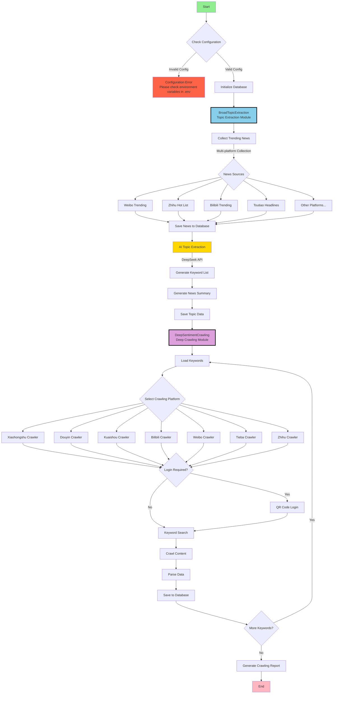

# MindSpider - AI Crawler Designed for Public Opinion Analysis

> Disclaimer:
> All content in this repository is for learning and reference purposes only. Commercial use is prohibited. No individual or organization may use the content of this repository for illegal purposes or to infringe on the legitimate rights of others. The web scraping technology involved in this repository is only for learning and research purposes and must not be used for large-scale scraping of other platforms or any other illegal activities. This repository assumes no responsibility for any legal liabilities arising from the use of its content. By using the content of this repository, you agree to all terms and conditions of this disclaimer.

## Project Overview

MindSpider is an intelligent public opinion crawler system based on Agent technology. It automatically identifies trending topics through AI and performs precise content scraping across multiple social media platforms. The system adopts a modular design, enabling a fully automated process from topic discovery to content collection.

This module is inspired by the well-known GitHub crawler project [MediaCrawler](https://github.com/NanmiCoder/MediaCrawler)

Two-step crawling approach:

- **Module 1**: Search Agent identifies trending news from **13** social media platforms and tech forums including Weibo, Zhihu, GitHub, Coolapk, etc., and maintains a daily topic analysis table.
- **Module 2**: Full-platform crawler performs deep crawling for fine-grained public opinion feedback on each topic.

<div align="center">


MindSpider Running Example
</div>

### Technical Architecture

- **Programming Language**: Python 3.9+
- **AI Framework**: DeepSeek by default, supports multiple APIs (for topic extraction and analysis)
- **Crawler Framework**: Playwright (browser automation)
- **Database**: MySQL (persistent data storage)
- **Concurrency**: AsyncIO (asynchronous concurrent scraping)

## Project Structure

```
MindSpider/
├── BroadTopicExtraction/           # Topic extraction module
│   ├── database_manager.py         # Database manager
│   ├── get_today_news.py          # News collector
│   ├── main.py                    # Module main entry
│   └── topic_extractor.py         # AI topic extractor
│
├── DeepSentimentCrawling/         # Deep crawling module
│   ├── keyword_manager.py         # Keyword manager
│   ├── main.py                   # Module main entry
│   ├── platform_crawler.py       # Platform crawler manager
│   └── MediaCrawler/             # Multi-platform crawler core
│       ├── base/                 # Base classes
│       ├── cache/                # Cache system
│       ├── config/               # Configuration files
│       ├── media_platform/       # Platform implementations
│       │   ├── bilibili/        # Bilibili crawler
│       │   ├── douyin/          # Douyin (TikTok China) crawler
│       │   ├── kuaishou/        # Kuaishou crawler
│       │   ├── tieba/           # Baidu Tieba crawler
│       │   ├── weibo/           # Weibo crawler
│       │   ├── xhs/             # Xiaohongshu (RED) crawler
│       │   └── zhihu/           # Zhihu crawler
│       ├── model/               # Data models
│       ├── proxy/               # Proxy management
│       ├── store/               # Storage layer
│       └── tools/               # Utilities
│
├── schema/                       # Database schema
│   ├── db_manager.py            # Database management
│   ├── init_database.py         # Initialization script
│   └── mindspider_tables.sql    # Table structure definitions
│
├── config.py                    # Global configuration file
├── main.py                      # System main entry
├── requirements.txt             # Dependencies list
└── README.md                    # Project documentation
```

## System Workflow

### Overall Architecture Flowchart



### Workflow Description

#### 1. BroadTopicExtraction (Topic Extraction Module)

This module is responsible for automatic daily trending topic discovery and extraction:

1. **News Collection**: Automatically collects trending news from multiple mainstream platforms (Weibo, Zhihu, Bilibili, etc.)
2. **AI Analysis**: Uses DeepSeek API for intelligent news analysis
3. **Topic Extraction**: Automatically identifies trending topics and generates related keywords
4. **Data Storage**: Saves topics and keywords to MySQL database

#### 2. DeepSentimentCrawling (Deep Crawling Module)

Based on extracted topic keywords, performs deep content crawling across major social platforms:

1. **Keyword Loading**: Reads daily extracted keywords from database
2. **Platform Crawling**: Uses Playwright for automated crawling across 7 major platforms
3. **Content Parsing**: Extracts posts, comments, interaction data, etc.
4. **Sentiment Analysis**: Performs sentiment analysis on crawled content
5. **Data Persistence**: Stores all data in structured format to database

## Database Architecture

### Core Data Tables

1. **daily_news** - Daily News Table
   - Stores trending news collected from various platforms
   - Contains title, link, description, ranking, etc.

2. **daily_topics** - Daily Topics Table
   - Stores AI-extracted topics and keywords
   - Contains topic name, description, keyword list, etc.

3. **topic_news_relation** - Topic-News Relation Table
   - Records associations between topics and news
   - Contains relevance scores

4. **crawling_tasks** - Crawling Tasks Table
   - Manages crawling tasks for each platform
   - Records task status, progress, results, etc.

5. **Platform Content Tables** (inherited from MediaCrawler)
   - xhs_note - Xiaohongshu posts (temporarily deprecated, see: https://github.com/NanmiCoder/MediaCrawler/issues/754)
   - douyin_aweme - Douyin videos
   - kuaishou_video - Kuaishou videos
   - bilibili_video - Bilibili videos
   - weibo_note - Weibo posts
   - tieba_note - Tieba posts
   - zhihu_content - Zhihu content

## Installation & Deployment

### Requirements

- Python 3.9 or higher
- MySQL 5.7 or higher, or PostgreSQL
- Conda environment: pytorch_python11 (recommended)
- Operating System: Windows/Linux/macOS

### 1. Clone the Project

```bash
git clone https://github.com/yourusername/MindSpider.git
cd MindSpider
```

### 2. Create and Activate Environment

#### Conda Configuration

```bash
# Create conda environment named pytorch_python11 with specified Python version
conda create -n pytorch_python11 python=3.11
# Activate the environment
conda activate pytorch_python11
```

#### UV Configuration

> [UV is a fast and lightweight Python package environment management tool, suitable for low dependency and convenient management needs. Reference: https://github.com/astral-sh/uv]

- Install uv (if not installed)
```bash
pip install uv
```
- Create and activate virtual environment
```bash
uv venv --python 3.11 # Create Python 3.11 environment
source .venv/bin/activate   # Linux/macOS
# or
.venv\Scripts\activate      # Windows
```

### 3. Install Dependencies

```bash
# Install Python dependencies
pip install -r requirements.txt

# or
# uv version is faster
uv pip install -r requirements.txt

# Install Playwright browser drivers
playwright install
```

### 4. Configure the System

Copy the .env.example file to .env and place it in the project root directory. Edit the `.env` file to set database and API configurations:

```python
# MySQL Database Configuration
DB_HOST = "your_database_host"
DB_PORT = 3306
DB_USER = "your_username"
DB_PASSWORD = "your_password"
DB_NAME = "mindspider"
DB_CHARSET = "utf8mb4"

# MINDSPIDER API Keys
MINDSPIDER_BASE_URL=your_api_base_url
MINDSPIDER_API_KEY=sk-your-key
MINDSPIDER_MODEL_NAME=deepseek-chat
```

### 5. Initialize the System

```bash
# Check system status
python main.py --status
```

## Usage Guide

### Complete Workflow

```bash
# 1. Run topic extraction (get trending news and keywords)
python main.py --broad-topic

# 2. Run crawler (crawl content from platforms based on keywords)
python main.py --deep-sentiment --test

# Or run the complete workflow at once
python main.py --complete --test
```

### Using Modules Independently

```bash
# Get today's trending topics and keywords only
python main.py --broad-topic

# Crawl specific platforms only
python main.py --deep-sentiment --platforms xhs dy --test

# Specify date
python main.py --broad-topic --date 2024-01-15
```

## Crawler Configuration (Important)

### Platform Login Configuration

**First-time use requires login for each platform - this is the most critical step:**

1. **Xiaohongshu Login** (temporarily deprecated, see: https://github.com/NanmiCoder/MediaCrawler/issues/754)
```bash
# Test Xiaohongshu crawling (will display QR code)
python main.py --deep-sentiment --platforms xhs --test
# Scan QR code with Xiaohongshu app to login, state will be saved automatically after successful login
```

2. **Douyin Login**
```bash
# Test Douyin crawling
python main.py --deep-sentiment --platforms dy --test
# Scan QR code with Douyin app to login
```

3. **Other platforms follow the same pattern**
```bash
# Kuaishou
python main.py --deep-sentiment --platforms ks --test

# Bilibili
python main.py --deep-sentiment --platforms bili --test

# Weibo
python main.py --deep-sentiment --platforms wb --test

# Tieba
python main.py --deep-sentiment --platforms tieba --test

# Zhihu
python main.py --deep-sentiment --platforms zhihu --test
```

### Login Troubleshooting

**If login fails or gets stuck:**

1. **Check network**: Ensure you can normally access the corresponding platform
2. **Disable headless mode**: Edit `DeepSentimentCrawling/MediaCrawler/config/base_config.py`
   ```python
   HEADLESS = False  # Change to False to see browser interface
   ```
3. **Manual verification**: Some platforms may require manual captcha verification
4. **Re-login**: Delete the `DeepSentimentCrawling/MediaCrawler/browser_data/` directory and re-login

### Other Issues

https://github.com/666ghj/BettaFish/issues/185

### Adjusting Crawling Parameters

Before actual use, it's recommended to adjust crawling parameters:

```bash
# Small-scale test (recommended to test like this first)
python main.py --complete --test

# Adjust crawling quantity
python main.py --complete --max-keywords 20 --max-notes 30
```

### Advanced Features

#### 1. Date-specific Operations
```bash
# Extract topics for a specific date
python main.py --broad-topic --date 2024-01-15

# Crawl content for a specific date
python main.py --deep-sentiment --date 2024-01-15
```

#### 2. Platform-specific Crawling
```bash
# Crawl only Bilibili and Douyin
python main.py --deep-sentiment --platforms bili dy --test

# Crawl specific amount of content from all platforms
python main.py --deep-sentiment --max-keywords 30 --max-notes 20
```

## Common Parameters

```bash
--status              # Check project status
--setup               # Initialize project (deprecated, now auto-initialized)
--broad-topic         # Topic extraction
--deep-sentiment      # Crawler module
--complete            # Complete workflow
--test                # Test mode (small amount of data)
--platforms xhs dy    # Specify platforms
--date 2024-01-15     # Specify date
```

## Supported Platforms

| Code | Platform | Code | Platform |
|-----|-----|-----|-----|
| xhs | Xiaohongshu (RED) | wb | Weibo |
| dy | Douyin (TikTok China) | tieba | Baidu Tieba |
| ks | Kuaishou | zhihu | Zhihu |
| bili | Bilibili | | |

## FAQ

### 1. Crawler Login Failed
```bash
# Problem: QR code doesn't display or login fails
# Solution: Disable headless mode, login manually
# Edit: DeepSentimentCrawling/MediaCrawler/config/base_config.py
HEADLESS = False

# Re-run login
python main.py --deep-sentiment --platforms xhs --test
```

### 2. Database Connection Failed
```bash
# Check configuration
python main.py --status

# Verify database configuration in config.py is correct
```

### 3. Playwright Installation Failed
```bash
# Reinstall
pip install playwright

# or

uv pip install playwright

playwright install
```

### 4. Crawled Data is Empty
- Ensure platform login was successful
- Check if keywords exist (run topic extraction first)
- Use test mode to verify: `--test`

### 5. API Call Failed
- Check if DeepSeek API key is correct
- Confirm API quota is sufficient

## Important Notes

1. **First-time use must login to each platform first**
2. **Recommended to use test mode to verify first**
3. **Follow platform usage rules**
4. **For learning and research purposes only**

## Development Guide

### Extending New News Sources

Add new news sources in `BroadTopicExtraction/get_today_news.py`:

```python
async def get_new_platform_news(self) -> List[Dict]:
    """Get trending news from new platform"""
    # Implement news collection logic
    pass
```

### Extending New Crawler Platforms

1. Create new platform directory under `DeepSentimentCrawling/MediaCrawler/media_platform/`
2. Implement platform core modules:
   - `client.py`: API client
   - `core.py`: Crawler core logic
   - `login.py`: Login logic
   - `field.py`: Data field definitions

### Database Extension

To add new tables or fields, update `schema/mindspider_tables.sql` and run:

```bash
python schema/init_database.py
```

## Performance Optimization Suggestions

1. **Database Optimization**
   - Regularly clean historical data
   - Create indexes for frequently queried fields
   - Consider using partitioned tables for large data volumes

2. **Crawling Optimization**
   - Set reasonable crawling intervals to avoid being rate-limited
   - Use proxy pools for improved stability
   - Control concurrency to avoid resource exhaustion

3. **System Optimization**
   - Use Redis to cache hot data
   - Use async task queues for time-consuming operations
   - Regularly monitor system resource usage

## API Interface Description

The system provides Python API for secondary development:

```python
from BroadTopicExtraction import BroadTopicExtraction
from DeepSentimentCrawling import DeepSentimentCrawling

# Topic extraction
async def extract_topics():
    extractor = BroadTopicExtraction()
    result = await extractor.run_daily_extraction()
    return result

# Content crawling
def crawl_content():
    crawler = DeepSentimentCrawling()
    result = crawler.run_daily_crawling(
        platforms=['xhs', 'dy'],
        max_keywords=50,
        max_notes=30
    )
    return result
```

## License

This project is for learning and research purposes only. Commercial use is prohibited. Please comply with relevant laws and regulations and platform terms of service when using this project.

---

**MindSpider** - Let AI empower public opinion insights, your intelligent content analysis assistant
